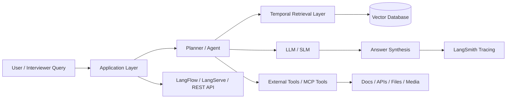

# Architecture Guide

## 1. High-Level Architecture

## 2. Core Components

### A. Retrieval Layer
- Converts documents, notes, or structured items into embeddings
- Stores them in Chroma, pgvector, FAISS, or another vector store
- Retrieves top-k relevant chunks with metadata such as timestamps and tags

### B. Temporal Layer
- Adds time awareness: versioning, historical context, recency scoring
- Helps answer questions like “What changed after Q2?” or “What was the prior policy?”

### C. Agentic Layer
- Decides whether to search, call tools, or ask clarifying questions
- Uses language model reasoning and structured tool workflows
- Supports iteration until the answer is complete or a stop condition is reached

### D. Multimodal Layer
- Images: OCR, object detection, vision-language understanding
- Audio: transcription, diarization, summarization, emotion cues
- Video: frame sampling, scene detection, video captions, summarization

### E. MCP Layer
- Standardizes tool exposure to agents
- Makes agent capabilities composable across services and systems
- Useful for environment tools, data connectors, and prompt-based actions

### F. Observability Layer
- LangSmith helps trace prompts, chains, tool calls, costs, and failures
- Enables debugging and interview-ready demonstrations

## 3. Layered Design

### L0: Model Layer
- LLMs for reasoning, planning, summarization
- SLMs for edge or lightweight tasks
- Specialized vision/audio models for multimodal tasks

### L1: Orchestration Layer
- LangChain for chain building
- LangGraph for stateful agent workflows
- LangServe for serving agents as APIs
- LangFlow for no-code visual flow prototyping

### L2: Retrieval / Knowledge Layer
- Embedding model
- Metadata filters
- Temporal indexing and chunking

### L3: Tooling Layer
- Search tools
- MCP servers
- File system tools
- API tools
- Database tools

### L4: Service Layer
- REST endpoints for Q&A
- Background jobs for ingestion
- Streaming / real-time interaction

## 4. Design Trade-offs

- Use LLMs for planning and synthesis; use SLMs for narrow tasks where latency/cost matters.
- Use vector search for local knowledge retrieval; use tools for dynamic or external information.
- Use temporal metadata to avoid stale answers.
- Use indexing, chunk overlap, and metadata filtering to improve retrieval accuracy.
- Add human review or grounding rules in production pipelines.

## 5. Interview Readiness

When discussing this system in interviews, emphasize:

- Problem framing
- Retrieval quality and latency trade-offs
- Tool orchestration and reasoning loops
- Observability and evaluation
- Multimodal pipeline design
- Deployment architecture and integration patterns

## 6. Typical Production Sequence

1. Ingest data into a vector store with metadata
2. Embedding generation and chunking
3. Retrieval with filters and re-ranking
4. Agent decides whether to use retrieval or tools
5. Tool calls and reasoning loops run
6. Answer is generated and traced
7. Results are evaluated and monitored

## 7. Suggested Deployment Modes

- Local notebook or dev server
- FastAPI service for Python
- Spring Boot service for Java
- LangServe endpoint for agent API
- LangFlow for visual experimentation

This architecture is intentionally modular so the same ideas can be implemented in Python and Java without changing the conceptual design.
